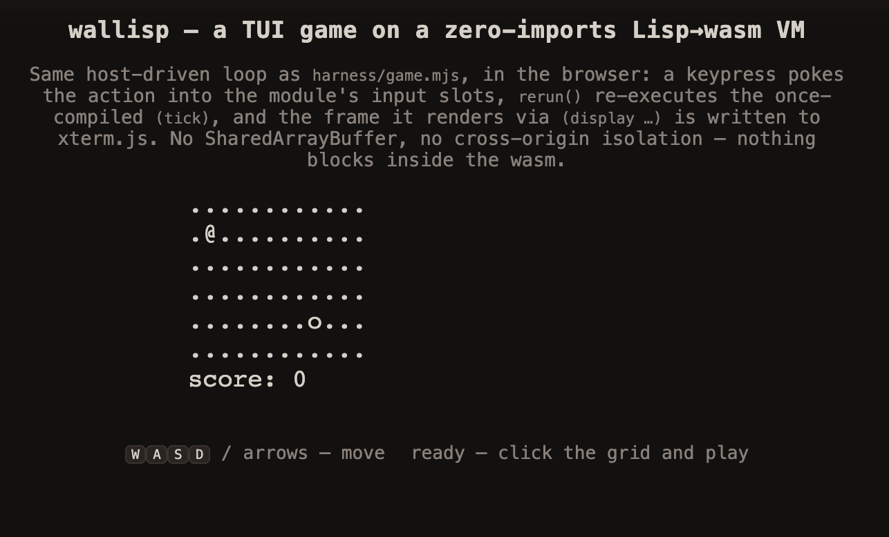

# wallisp — tiny Lisp → WebAssembly

A small Lisp implemented eight ways across three architectures (tree-walker,
CEK machine, bytecode VM) and three GC strategies (none, mark-sweep,
region-drop), compiled to freestanding `wasm32` with **zero imports**, then
driven by measurement to a finalist: a bytecode VM with TCO and a
hand-rolled mark-sweep GC.

## Quick start

```bash
bash build.sh                            # builds engines -> *.wasm (needs clang+wasm-ld and node)
node harness/test_bc.mjs                 # bytecode correctness suite (35 cases × 2 engines)
node harness/parity.mjs                  # cross-engine parity (55 programs × 8 engines)
node harness/lisp-cli.mjs -e "(begin (define fib (lambda (n) (if (< n 2) n (+ (fib (- n 1)) (fib (- n 2)))))) (fib 20))"
# open web/tiny-lisp-vm.html in a browser — self-contained live REPL + writeup
```

Prebuilt `*.wasm` modules are checked in at the repo root, so the harness and CLI
work without running `build.sh` first.

`harness/bench.mjs` also prints a **baselines** table: the same five
benchmarks hand-written in JS (V8 native) and C (`-O2` native), no interpreter.
The C row needs `bash build.sh --native` to produce `native_bench_baseline`;
standalone equivalents live in `baselines/bench.{js,c}`.

## What this is, and what it isn't

This is a **measurement study**, not a Lisp you should embed in a product.
Engines run ~370–530 lines (with `bytecode_gc` at ~850 lines as the
finalist+experiment host), which is what makes A/B comparisons honest.
PR1 added primitive arity/type validation, `/` and `mod`, and arithmetic
overflow detection across all eight engines, so the shared semantic floor
is real — `(+ 1)`, `(+ 'a 1)`, and `((lambda (x) x) 1 2)` all return
`<error>` rather than silently degrading. `bytecode_gc` carries extensions
(strings, `set-car!`/`set-cdr!` mutation) the other engines don't; the
parity harness gates those programs accordingly. Some malformed programs
still surface as bare `<error>`. The comparisons remain apples-to-apples
on the shared core; don't mistake "agrees across engines" for "is a robust
Scheme implementation."

## Built on the finalist: a browser TUI game



The finalist engine is real enough to host an interactive, real-time terminal
game, in the browser, on the same zero-imports module. The loop is host-driven:
a keypress pokes the action into the module's input slots, `rerun()` re-executes
the once-compiled `(tick)`, and the frame it renders via `(display …)` is written
to xterm.js. No SharedArrayBuffer, no cross-origin isolation — nothing blocks
inside the wasm.

```bash
node harness/game.mjs                          # play in your terminal (raw TTY)
printf 'dddddddsssq' | node harness/game.mjs   # or headless: replays keys, prints frames
bash web/build-game.sh                         # regenerate web/game.html, then open it in a browser
```

The path there (persistent session, raw frame output, an O(1) per-frame string
region-drop, and run-without-recompile for unbounded play) is recorded slice by
slice in
**[docs/notes/terminal_game_roadmap.md](docs/notes/terminal_game_roadmap.md)**
(with ADRs 003–005 in `docs/notes/decisions.md`).

## Learn more

- **[docs/index.html](docs/index.html)** — external write-up: the headline
  findings with charts, code snippets, and the methodology, in a single
  self-contained HTML page. The friendly entry point if you're just visiting.
- **[ENGINES.md](ENGINES.md)** — side-by-side comparison of the eight engines:
  what each one is, what it costs, and what it taught us. Start here if you
  want the map.
- **[DEV.md](DEV.md)** — architectural tour: the language, the engines, the
  bytecode ISA, the GC, the optimization ladder, the hand-editable WAT track,
  and open threads.
- **[FINDINGS.md](FINDINGS.md)** — the empirical record: benchmark tables,
  pre-registered hypotheses, and surprises that refuted armchair guesses.
- **[CLAUDE.md](CLAUDE.md)** — instructions for Claude Code agents working in
  this repo.

## License

MIT — see [LICENSE](LICENSE).
